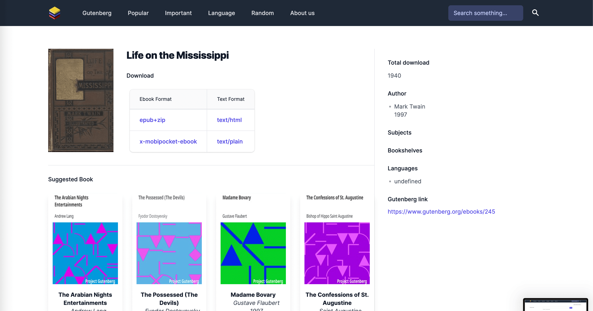

# Search Engine

## French version

Projet d'algorithmique de DAAR (module du Master 2 STL)

Objectif : Réaliser un moteur de recherche d'une bibliothèque permettant de trouver l'occurrence d'un mot ou une serie de mots dans un ensemble de livres, en utilisant les algorithmes connus dans la litterature scientifique (Jaccard, Aho-Ullman etc.)

## English Version

DAAR algorithmic project (Master 2 STL module)

Objective: Create a library search engine to find the occurrence of a word or a series of words in a set of books, using algorithms known in scientific literature (Jaccard, Aho-Ullman etc.) 

## Original repository

https://gitlab.alessandroserver.com/search-engine/back
https://gitlab.alessandroserver.com/search-engine/front

## Contributors

https://github.com/nyandrianinamamy
https://github.com/willdow

## Front

### Installation

```sh
yarn
```

### Development

```sh
cp .env.example .env
yarn dev
```

### Build

```sh
yarn build
```

### Demo


A complete video demo is available at : [video](front-end/doc/demo.mov)

### Screenshot

Home page :

Search page :

Detail and similar book page :

Popular page :


## BACK

### Installation

Prérequis:

- Mongodb
- Nodejs 16+
- Python 3

```bash
git clone <url-projet>
cd back
npm install #or
yarn install
```

### Lancement de l'api

```
npm run server
```

Pour vérifier que l'api fonctionne :

```
$ curl -s http://localhost:3000/
> API Running
```

### Initialisation de la base

À lancer dans un autre terminal, il est nécessaire que l'api soit lancé avant d'exécuter ces scripts.  
Télécharge une centaine de livres, insère les métadonnées dans la base, effectue le forward indexing.

Attention l'exécution de la tâche peut aller à plus de 4h. Pour diminuer le temps, il faudrait prendre un nombre de livre moins conséquente. (détaillé dans la prochaine section)

```bash
cd data-loading
npm install
chmod +x run.sh
./run.sh
```

Inverted indexing:

```bash
python3 backward_index.py
```

Distance de Jaccard entre tous les couples de livres :

```bash
python3 jaccard_distance.py
```

### Tester avec 30 livres

Nous pouvons testé les scripts avec 30 livres pour commencer.
Aller dans `data-loading/test/data.csv`, conserver que les 30 premières lignes.
